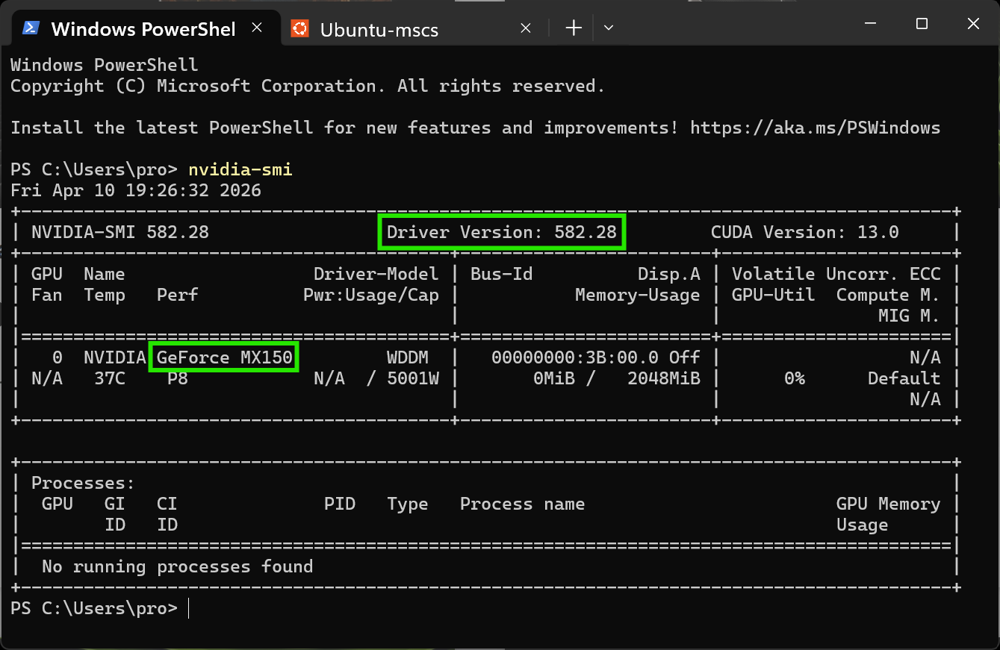
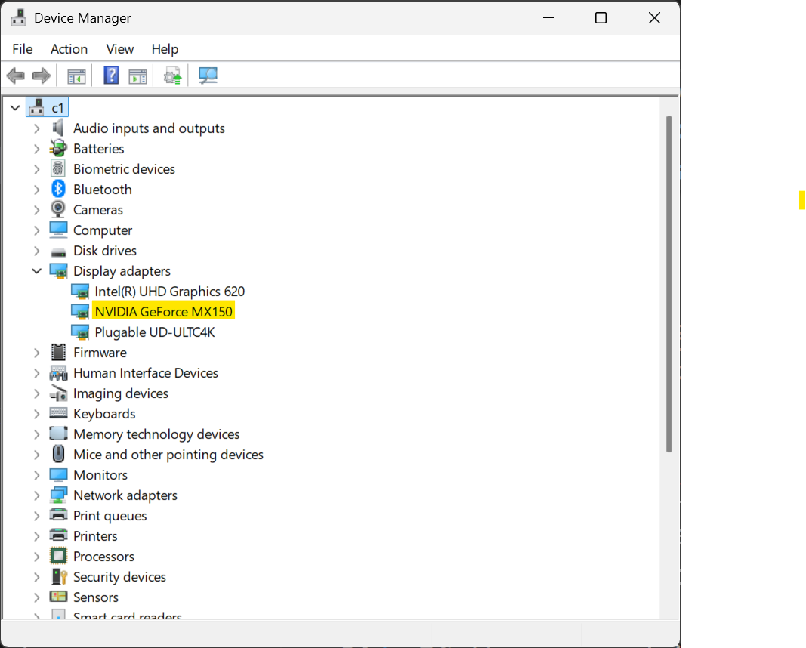
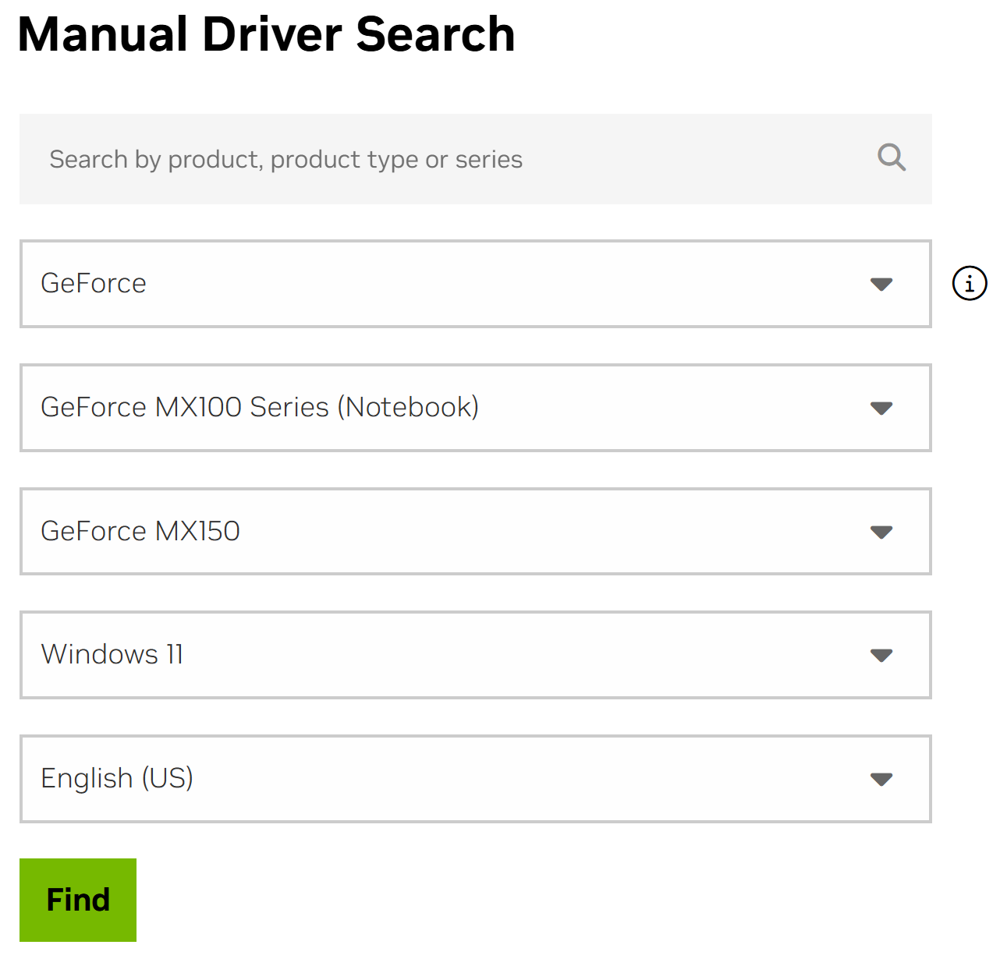

# CS 580 – Windows Subsystem for Linux (WSL) Setup

These instructions will guide you through setting up a WSL 2 environment on Windows, which allows deep learning applications to use your GPU to accelerate training and inference. This setup is recommended for students with NVIDIA GPUs who want to run deep learning workloads on their local machines.

**Table of Contents**
- [CS 580 – Windows Subsystem for Linux (WSL) Setup](#cs-580--windows-subsystem-for-linux-wsl-setup)
  - [Verify Prerequisites](#verify-prerequisites)
  - [Install or Update NVIDIA GPU Driver](#install-or-update-nvidia-gpu-driver)
  - [Install VS Code in Windows](#install-vs-code-in-windows)
  - [Install WSL 2](#install-wsl-2)
  - [Setup Ubuntu-mscs](#setup-ubuntu-mscs)

## Verify Prerequisites

These instructions assume you have the hardware and software listed below:

- NVIDIA® GPU card with CUDA® architectures 3.5, 5.0, 6.0, 7.0, 7.5, 8.0 and higher. See the list of [CUDA®-enabled GPU cards](https://developer.nvidia.com/cuda-gpus).

- Windows 11 or Windows 10 2022 | Version 2022 or higher (Build 19044 or higher).
  - If older version, [update Win 10 now](https://www.microsoft.com/en-us/software-download/windows10).
  - If you cannot update Windows, [manually install](https://learn.microsoft.com/en-us/windows/wsl/install-manual) WSL 2 (Steps 1-5) and Ubuntu-24.04 (Step 6).

- Visual Studio Code (recommended) or other IDE that supports WSL development. If you select another IDE, you will need to configure it on your own to work with WSL and your deep learning frameworks.

If you do not know which version/build of Windows you have, open **Settings → System → About** and check the **Windows info** section or run the command `winver` in PowerShell.

If you do not have or cannot install these requirements, follow **Windows CPU-only** setup instructions in [win/README.md](win/README.md).

## Install or Update NVIDIA GPU Driver

If you already have an NVIDIA GPU driver installed, run the following command in PowerShell and note your NVIDIA GPU full product name and driver version information:

```powershell
nvidia-smi
```



If the command is recognized and shows your GPU and driver information, check that your driver version is 528.33 or higher. If it is, skip to the [Install WSL 2](#install-wsl-2) section.

If the command is not recognized, check in **Device Manager** (search in Start menu) under the **Display adapters** section. If you see an NVIDIA product listed, note the full product name. An example shown highlighted in yellow below.



If your driver version is less (older) than 528.33, or if the `nvidia-smi` command is not recognized, you will need to install a recent NVIDIA driver for your GPU.

Follow these steps to install or update your NVIDIA GPU driver:

1. Go to the [NVIDIA Manual Driver Search](https://www.nvidia.com/Download/index.aspx) page.

2. Use the **Manual Driver Search** to find the appropriate driver for your GPU and Windows version. Using the example from the screenshots above, you would select:



3. Click the "View" button and then the "Download" button to download your selected driver. Do NOT enable automatic driver updates until you have completed CS 580. Automatic updates may install a driver version that is incompatible with the deep learning frameworks, which could cause errors when running your assignments and projects.

## Install VS Code in Windows

If VS Code is not installed in Windows, follow instructions at https://code.visualstudio.com/docs/setup/windows

## Install WSL 2

Open **PowerShell as Administrator** and run the following commands:

```powershell
wsl.exe --install -d Ubuntu-24.04 --name Ubuntu-mscs
```

When prompted, enter a username and password for your new Linux user account. Remember these credentials, as you will need them to log in to your WSL environment.

Then, type `exit` and hit \<Enter> once to exit out of your new Linux session and enter the following PowerShell commands:

```powershell
wsl.exe --set-default-version 2
wsl.exe --set-default Ubuntu-mscs
```

Type exit and hit \<Enter> until the PowerShell window closes.

## Setup Ubuntu-mscs

1. Launch **Ubuntu-mscs** anew from the Start menu (or type `wsl.exe -d Ubuntu-mscs` in PowerShell).

2. Copy and paste the following commands into the Ubuntu-mscs terminal to download and run the CS 580 setup script.  ***Important***: Replace `your-GitHub-username` and `your-GitHub-email` with your actual GitHub username and email address.

```bash
curl -fsSL -o setup_cs580.sh https://raw.githubusercontent.com/cs580dl/0-1/refs/heads/main/wsl/setup_cs580_wsl.sh
chmod +x setup_cs580.sh
./setup_cs580.sh your-GitHub-username your-GitHub-email
```
